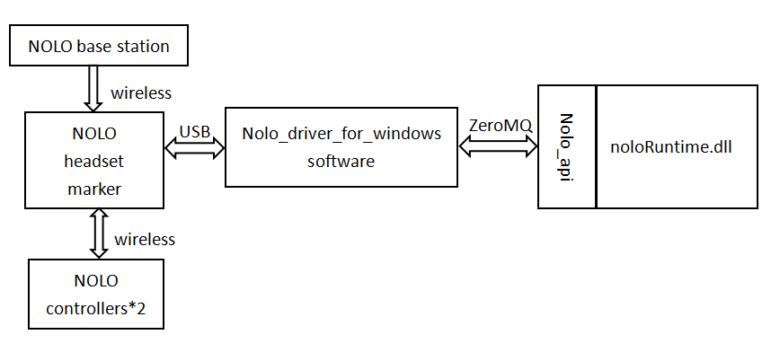

# Getting started
## Quick description  
NOLO users ZeroMQ sockets as a low-latency transmission to interact with any language of your choice.It can work locally and remotely over the network.  
For more information, please refer to ZeroMQ website:http://zeromq.org/ We use the PUB And Router ZMQ socket as a server,Sub And Dealter ZMQ socket as a client.  
Server PUB socket for unidirectional broadcast packets, Router socket to receive packets in one direction, the client Sub socket to receive packets in one direction,Dealter sockets for unidirectional send packets.   
Router socket port number:tcp://*:1315.  
PUB socket port number:tcp://*:1314.  
Nolo_driver_for_windows software as a NOLO ZeroMQ server.NoloRuntime.dll as the NOLO ZeroMQ client.  
NOLO_Windows software is a reference case using noloRuntime.dll, real-time monitoring NOLO server-side data and send vibration data to the server.  

As shown in the figure below, the NOLO device consists of a base station, a headset marker and two controllers, the base station and the controllers interact with the headset marker in a wireless communication. The headset marker gather the data and communicate with computer in two-way through the USB protocol. Computer-side Nolo_driver_for_windows software can get the data information of NOLO device, and transfer data to nolo_api in two-way through the ZeroMQ protocol. Nolo_driver_for_windows software is the socket server of PUB and Router ZMQ, noloRuntime.dll is the socket client of SUB and Dealer ZMQ.  

  

## Using Steps
* 1: Install vc_redist.x64.exe.   
* 2: Install Nolo_driver_for_windows_setup.msi software (required).   
* 3: Install the NOLO_Windows_Setup.msi software (optional).  
* 4: Bin directory provides the noloRuntime.dll plugin and the dependent plugins.  
* 5: The include directory provides nolo_api, detailing the outer interface functions and data structures of noloRuntime.dll.  
* 6: The ducuments directory provides a detailed description of NoloVrWindows sdk.
    
      

